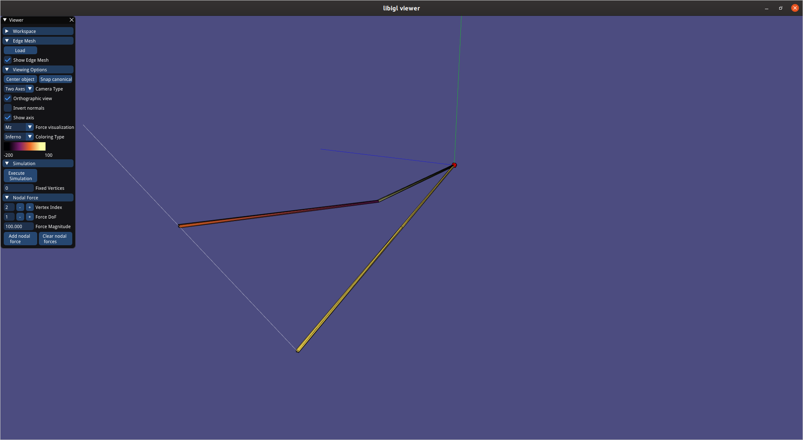

# MeshBeamFEA

A tool for modeling edge meshes using the Euler-Bernoulli beam theory and for executing a fea simulation on it. Displacements and forces are visualized.

### Prerequisites

Eigen and C++17
